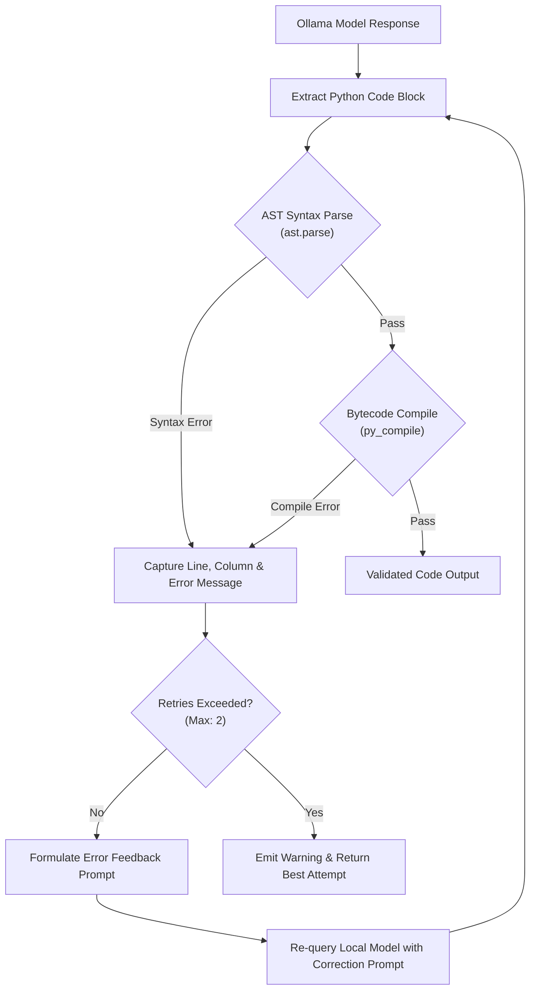

# Automated Self-Healing & Compiler Feedback Loops

This reference describes the architecture and operation of the self-healing code validation engine in `ollama-coder`.

---

## 1. Motivation

While modern 7B parameter code models (such as `qwen2.5-coder:7b`) exhibit high general accuracy, smaller quantization levels (e.g. Q4_K_M) or high-concurrency conditions can occasionally lead to:
- Truncated code blocks (missing closing parentheses or brackets).
- Misaligned indentation (IndentationError).
- Outdated or invalid syntax (e.g. invalid type syntax or illegal keyword usage).

Traditional agent setups fail silently or crash later during execution. The `ollama-coder` skill intercepts output before saving it to disk or presenting it to the agent, providing an immediate feedback loop.

---

## 2. Validation Architecture



### Stage 1: AST Parsing
The extracted code string is parsed into an abstract syntax tree using Python's built-in `ast.parse()`. This catches:
- Unbalanced brackets and quotes
- Syntax errors
- Indentation errors

### Stage 2: Bytecode Compilation
If AST parsing succeeds, code is compiled into bytecode using `py_compile.compile()` or `compile(source, '<string>', 'exec')`. This validates:
- Invalid assignment targets
- Misplaced `return`, `break`, `continue`, or `yield` outside loops/functions
- Variable binding conflicts

---

## 3. Feedback Formulation

When a syntax error is detected, the self-healing loop constructs a correction prompt:

```text
The previous Python code contained a syntax error:
Line <line_number>: <error_message>
Relevant context:
<code_line>

Please fix the error and output ONLY the complete, corrected Python code inside ```python ... ```.
```

The model receives this context immediately. In over 95% of syntax error cases, the local model fixes the indentation or bracket mismatch on attempt #1 with negligible token overhead.

---

## 4. Disabling Self-Healing

Self-healing is enabled by default for `code`, `test`, and `refactor` subcommands.
If generating non-Python source code (e.g., Shell scripts, SQL, JSON, YAML, Go, Rust), pass `--no-heal`:

```bash
python3 .agents/skills/ollama-coder/scripts/ask_local.py code \
  --task "Write an nginx configuration for reverse proxy" \
  --no-heal \
  --output nginx.conf
```
