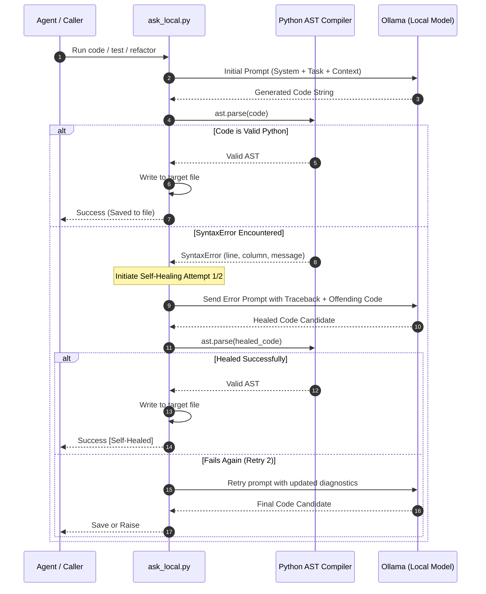

# 🤖 Ollama Coder Skill (`ollama-coder`)

The **`ollama-coder`** skill equips AI agents (such as Google Antigravity, Claude Code, Cursor, Windsurf, or Aider) to offload heavy software engineering workflows to local models running via Ollama. This provides zero cloud token cost, sub-second latency, offline execution, and automated self-healing syntax validation.

---

## 📂 Architecture & Directory Layout

The skill is defined inside `.agents/skills/ollama-coder/`:

```
.agents/skills/ollama-coder/
├── SKILL.md                  # Main agent skill definition & instructions
├── scripts/
│   └── ask_local.py          # Unified CLI script for agents and pipelines
└── references/
    ├── models.md             # Hardware sizing, profiles, and speed matrix
    └── self_healing.md       # Self-healing AST loop architecture & retry logic
```

Additionally, a standalone, distributable version suitable for publishing to an independent Git repository is packaged in [`packages/antigravity-local-coder/`](../packages/antigravity-local-coder/).

---

## ⚡ CLI Subcommands (`ask_local.py`)

The primary driver is `.agents/skills/ollama-coder/scripts/ask_local.py`, exposing four purpose-built subcommands:

### 1. Code Generation (`code`)
Generates production code from natural language prompts, automatically strips markdown fences, performs AST syntax verification, and writes to the destination path:
```bash
python3 .agents/skills/ollama-coder/scripts/ask_local.py code \
  --task "Implement a thread-safe sliding window rate limiter" \
  --output src/rate_limiter.py
```
Injecting context files:
```bash
python3 .agents/skills/ollama-coder/scripts/ask_local.py code \
  --task "Implement this caching interface using an async Redis backend" \
  --files src/cache_interface.py \
  --output src/redis_cache.py
```

### 2. Automated Test Generation (`test`)
Generates comprehensive unit test suites for an existing source file with edge cases, boundaries, and mocks:
```bash
python3 .agents/skills/ollama-coder/scripts/ask_local.py test \
  --file src/rate_limiter.py \
  --framework pytest \
  --output tests/test_rate_limiter.py
```
Supports `--framework pytest` or `--framework unittest`.

### 3. Architecture & Security Review (`review`)
Performs a deep static analysis audit of a target source file:
```bash
python3 .agents/skills/ollama-coder/scripts/ask_local.py review \
  --file src/server.py \
  --focus "race conditions, unhandled exceptions, and memory leaks" \
  --output reviews/server_audit.md
```

### 4. Refactoring & Typing (`refactor`)
Upgrades legacy code by injecting strict Python type annotations (`typing`), PEP 257 docstrings, and modular design patterns:
```bash
python3 .agents/skills/ollama-coder/scripts/ask_local.py refactor \
  --file src/legacy_util.py \
  --type-hints \
  --docstrings \
  --output src/legacy_util_typed.py
```

---

## 🎯 Model Profiles

The skill abstracts model selection into three standardized profiles:

| Profile | Target Model | Recommended Use Case |
| :--- | :--- | :--- |
| `--profile fast` | `qwen2.5-coder:3b` | Lightweight boilerplate, quick helpers, high-throughput utility generation. |
| `--profile coding` *(default)* | `qwen2.5-coder:7b` | Full algorithmic features, data structures, and deterministic unit test generation. |
| `--profile reasoning` | `llama3.1:8b` | Deep architectural audits, concurrency reviews, complex logic extraction. |

Any custom model can be specified explicitly via `--model <model_name>`.

---

## 🔄 Self-Healing Compiler Verification Loop

One of the common risks of local code generation is occasional syntax errors (unclosed brackets, indentation anomalies, invalid tokens). To eliminate manual human intervention, `ask_local.py` integrates an automatic **AST self-healing loop**:



### Disabling Validation
When generating non-Python languages (e.g. Bash, Rust, Go, SQL), disable the AST compiler:
```bash
python3 .agents/skills/ollama-coder/scripts/ask_local.py code \
  --task "Write an automated Docker compose script" \
  --no-heal \
  --output docker-compose.yml
```

---

## 💰 Cloud Token & Cost Savings Estimation

Offloading routine development tasks to local models significantly reduces frontier cloud model (Claude 3.5 Sonnet, GPT-4o) API expenditures.

The telemetry module computes estimated cloud savings after each invocation using standard industry token pricing:
$$\text{Cost Saved} = \left(\frac{\text{Prompt Tokens}}{1,000,000} \times \$3.00\right) + \left(\frac{\text{Completion Tokens}}{1,000,000} \times \$15.00\right)$$

| Model Run | Ingested Tokens | Completion Tokens | Frontier API Cost | Local Hardware Cost |
| :--- | :--- | :--- | :--- | :--- |
| Standard Feature | 1,500 | 800 | ~$0.0165 | **$0.00** |
| Large Test Suite | 5,000 | 2,500 | ~$0.0525 | **$0.00** |
| 100 Daily Agent Calls | 300,000 | 150,000 | ~$3.15 / day | **$0.00** |

---

## 🌐 Global Machine Installation

To register the skill globally across all Antigravity agent sessions on the machine:
```bash
./install_global_skill.sh
```
This script copies the skill files to `~/.gemini/config/skills/ollama-coder/` and registers the `ollama-local` MCP server in the global agent configuration.

---

## 📚 Related Documentation

- [Unified Local Coder Architecture](UNIFIED_LOCAL_CODER.md)
- [Prism Multi-Engine Connector](PRISM_LOCAL.md)
- [Foundry Coder Skill Guide](FOUNDRY_CODER_SKILL.md)
- [MCP Server Setup Guide](MCP_SERVER.md)
- [Tutorial: Agent MCP Integration](tutorials/04_AGENT_INTEGRATION_MCP.md)

