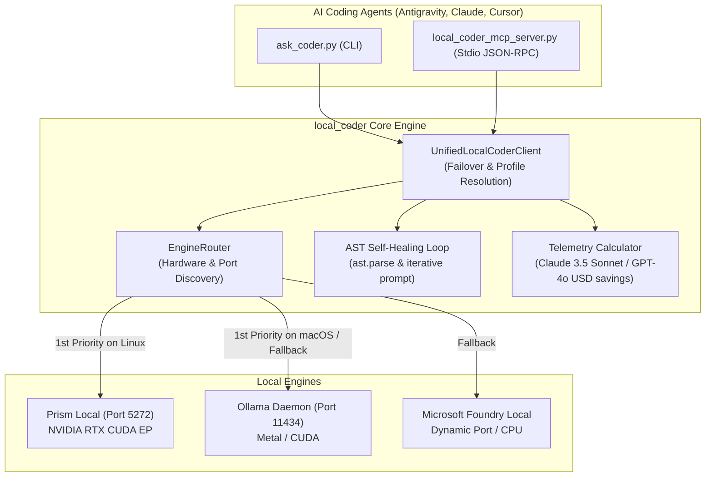

# 🌐 Unified Cross-Engine Local Coder (`local_coder`)

The **Unified Local Coder** (`local_coder`) is a consolidated, cross-engine architecture that unifies all local AI backends into a single intelligent routing layer, CLI tool (`ask_coder.py`), and Model Context Protocol (MCP) server (`local_coder_mcp_server.py`).

---

## 🎯 The Vision: True Cross-Engine Autonomy

Previously, this repository had separate skills and MCP servers for each backend:
- `ollama-coder` / `ollama-local`: Ollama backend (`qwen2.5-coder`, `llama3.1`).
- `foundry-coder` / `foundry-local`: Microsoft Foundry Local (`phi-3.5-mini`, `qwen3-0.6b`).
- `prism` / `prism-local`: Direct CUDA GPU accelerator for ONNX models on Linux/WSL2.

**`local_coder` unifies them all**:
1. **Dynamic Engine Routing & Failover**: Automatically probes and selects the fastest available engine on your hardware (Prism CUDA on Linux/WSL2 $\to$ Ollama Apple Silicon / CUDA $\to$ Microsoft Foundry Local).
2. **Abstract Task Profiles**: Agents request capabilities by profile (`coding`, `fast`, `reasoning`) rather than hardcoding backend model names.
3. **Integrated AST Self-Healing**: Validates generated Python syntax; if a `SyntaxError` occurs, automatically feeds the exact traceback back into the local model for immediate self-correction.
4. **Unified Stdio MCP Server**: Single MCP server exposing tools that work identically regardless of which engine is active.
5. **Real-time Telemetry & Cost Tracking**: Automatically calculates token counts and cumulative USD savings compared to cloud models (Claude 3.5 Sonnet and GPT-4o).

---

## 🏗 System Architecture



---

## 🚀 Quickstart & Usage

### 1. Installation

Deploy the unified skill and register the MCP server with one command:
```bash
./install_unified.sh
```
This script:
- Links `ask_coder.py` to `~/.local/bin/ask-coder`.
- Installs the unified `local-coder` skill to `~/.gemini/config/skills/local-coder`.
- Configures `local-coder-unified-mcp` in `~/.gemini/config/mcp_config.json`.

---

### 2. Unified CLI Commands (`ask_coder.py`)

#### System Status & Engine Discovery
Inspect connected engines, available models, hardware detection, and active routing:
```bash
python3 ask_coder.py status
```

#### Code Generation with AST Self-Healing
```bash
python3 ask_coder.py code \
  --task "Implement a thread-safe sliding window rate limiter with TTL" \
  --output src/rate_limiter.py
```

#### Unit Test Suite Authoring
Generate comprehensive tests with pytest mocks and edge cases:
```bash
python3 ask_coder.py test \
  --file src/rate_limiter.py \
  --framework pytest \
  --output tests/test_rate_limiter.py
```

#### Architecture & Security Audit
Audit source code for concurrency bugs, memory leaks, and vulnerabilities:
```bash
python3 ask_coder.py review \
  --file src/server.py \
  --focus "race conditions, unhandled exceptions, and deadlocks"
```

#### Refactoring & Modernization
Add strict type hints (`typing`), PEP 257 docstrings, and clean design:
```bash
python3 ask_coder.py refactor \
  --file src/legacy_util.py \
  --type-hints \
  --docstrings \
  --output src/legacy_util_typed.py
```

#### Manual Engine Selection (Optional)
Force a specific engine instead of auto-routing:
```bash
python3 ask_coder.py code --task "..." --engine prism
python3 ask_coder.py code --task "..." --engine ollama
python3 ask_coder.py code --task "..." --engine foundry
```

---

## 🔌 Unified MCP Tools

When registered with your AI agent, `local-coder-unified-mcp` provides the following tools:

| Tool Name | Parameters | Purpose |
|---|---|---|
| `local_code` | `task`, `context`, `engine`, `profile` | Generates verified Python code with AST self-healing. |
| `local_test` | `file_path`, `code`, `framework`, `engine` | Generates comprehensive unit tests (`pytest` or `unittest`). |
| `local_code_review` | `file_path`, `code`, `focus`, `engine` | Audits code for security, race conditions, and bottlenecks. |
| `local_refactor` | `file_path`, `code`, `type_hints`, `docstrings`, `engine` | Refactors code for strict typing and readability. |
| `local_status` | _none_ | Returns hardware info, active engines, and loaded models. |
| `list_local_models` | _none_ | Lists all models discovered across Prism, Ollama, and Foundry. |

### Example MCP Configuration (`mcp_config.json`)
```json
{
  "mcpServers": {
    "local-coder-unified-mcp": {
      "command": "python3",
      "args": [
        "/home/senssei/05-local-coders/local_coder_mcp_server.py"
      ],
      "env": {
        "PRISM_BASE_URL": "http://127.0.0.1:5272/v1",
        "OLLAMA_BASE_URL": "http://127.0.0.1:11434"
      }
    }
  }
}
```

---

## 💡 Engine Selection Strategy

The unified router chooses the optimal engine automatically based on hardware and daemon availability:

| Operating System | Hardware | 1st Priority | 2nd Priority | 3rd Priority |
|---|---|---|---|---|
| **Linux / WSL2** | NVIDIA RTX GPU | **Prism** (CUDA EP, port 5272) | **Ollama** (CUDA) | **Foundry Local** |
| **macOS** | Apple Silicon (M-series) | **Ollama** (Metal & UMA) | **Foundry Local** | **Prism** |
| **Any / CPU** | Generic x86_64 | **Ollama** (`llama.cpp` CPU) | **Foundry Local** | **Prism** |

If an active engine is stopped or offline, the client seamlessly fails over to the next available provider.
