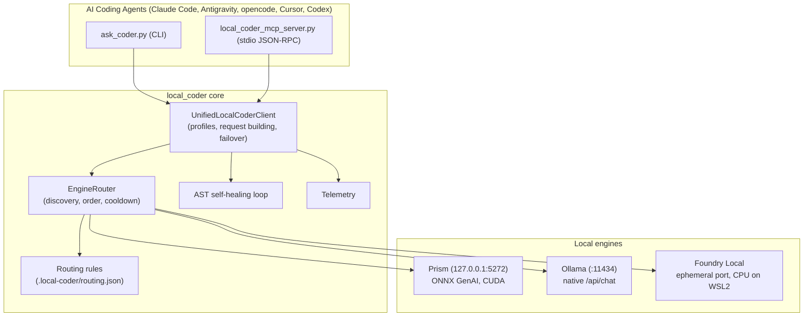

# 🌐 Unified Cross-Engine Local Coder (`local_coder`)

The **Unified Local Coder** (`local_coder`) is a cross-engine layer that unifies all local AI backends behind one routing client, one CLI (`ask_coder.py`) and one Model Context Protocol (MCP) server (`local_coder_mcp_server.py`).

---

## 🎯 What it gives you

The repository also ships per-engine skills (`ollama-coder`, `foundry-coder`) and a Prism connector. `local_coder` is the shared core underneath all of them (the per-engine scripts are thin entry points over it), and the recommended interface on its own:

1. **Engine routing & failover**: probes Prism, Ollama and Foundry Local, picks one by platform order, and fails over when a request cannot connect. Exceptions to the order live in a validated JSON file ([Routing exceptions](ROUTING.md)).
2. **Task profiles**: ask for `coding`, `fast` or `reasoning` instead of hard-coding a backend's model name.
3. **AST self-healing**: generated Python that does not parse is fed back to the model; see [Self-healing](#-self-healing) for exactly what is and is not guaranteed.
4. **One MCP server**: the same tools whichever engine answers.
5. **Telemetry**: tokens (healing retries included), decode speed as reported by the engine, and a *notional* saving against a reference price of $3 / $15 per 1M prompt / completion tokens (`LOCAL_CODER_PRICE_PROMPT` / `LOCAL_CODER_PRICE_COMPLETION` change it). It is an estimate, not a bill.
6. **Truncation is never silent**: with the default limit, output that is cut off is retried once with double the budget; if it is still cut off, or you set `--max-tokens` yourself, the result carries a `⚠️ Output truncated` line.

---

## 🏗 System Architecture



Prism and Foundry Local both default to `127.0.0.1:5272`. When one server answers for both, the router treats it as a single engine (Prism wins), so a failover never lands on the endpoint that just failed.

---

## 🚀 Quickstart & Usage

### 1. Installation

One installer registers the skill and MCP server with every coding harness it finds (Claude Code, Antigravity, opencode, Gemini CLI, Cursor, Codex):
```bash
python3 install.py --list       # supported harnesses and what was detected
python3 install.py --dry-run    # show every change, make none
python3 install.py --python /usr/bin/python3
```
The code is staged once in `~/.local/share/local-coders/`; skills are symlinks to it, `ask-coder` is linked into `~/.local/bin`, and the MCP entry points at `local_coder_mcp_server.py` there. See the [README](../README.md#install) for the harness table and flags.

---

### 2. Unified CLI (`ask_coder.py`)

`--engine` is a **global** option and goes *before* the subcommand. Options after the subcommand belong to it.

```text
ask_coder.py [--engine auto|prism|ollama|foundry] <code|test|review|refactor|status> [options]
```

| Subcommand | Options |
|---|---|
| `code` | `--task` *(required)*, `--files F…`, `--model`, `--profile coding\|fast\|reasoning`, `--language`, `--output`, `--no-heal`, `--max-tokens` |
| `test` | `--file` *(required)*, `--framework FRAMEWORK` *(default: pytest for Python)*, `--language` *(default: python)*, `--model`, `--output`, `--no-heal`, `--max-tokens` |
| `review` | `--file` *(required)*, `--focus`, `--language` *(default: guessed from the file extension)*, `--model`, `--output`, `--max-tokens` |
| `refactor` | `--file` *(required)*, `--language` *(default: python)*, `--type-hints/--no-type-hints`, `--docstrings/--no-docstrings` *(both on by default)*, `--model`, `--output`, `--no-heal`, `--max-tokens` |
| `status` | `--explain` |
| `perf` | `--line` *(default)* or `--json`, `--max-age`, `--color`: the latest call and today's totals, for [status lines](STATUSLINE.md) |

`--max-tokens` defaults to 4096 and is doubled once (up to 16384) if the output is cut off; a value you pass explicitly is always respected. With no `--engine` the engine comes from `LOCAL_CODER_ENGINE`, else AUTO.

#### System status & engine discovery
```bash
python3 ask_coder.py status             # hardware, engines, latency, models
python3 ask_coder.py status --explain   # plus the active routing rules and where each task would go
```

#### Code generation with AST self-healing
```bash
python3 ask_coder.py code \
  --task "Implement a thread-safe sliding window rate limiter with TTL" \
  --output src/rate_limiter.py
```

#### Unit test suite authoring
```bash
python3 ask_coder.py test \
  --file src/rate_limiter.py \
  --framework pytest \
  --output tests/test_rate_limiter.py
```

#### Architecture & security audit
```bash
python3 ask_coder.py review \
  --file src/server.py \
  --focus "race conditions, unhandled exceptions, and deadlocks"
```

#### Refactoring & modernization
```bash
python3 ask_coder.py refactor \
  --file src/legacy_util.py \
  --output src/legacy_util_typed.py        # type hints and docstrings are on by default
```

#### Manual engine selection
An explicit engine bypasses routing rules:
```bash
python3 ask_coder.py --engine prism code --task "..."
python3 ask_coder.py --engine ollama code --task "..."
python3 ask_coder.py --engine foundry code --task "..."
```

---

## 🔌 Unified MCP Tools

`local-coder-unified-mcp` provides these tools. All generating tools also accept `max_tokens` (default 4096, doubled once if the output is cut off; an explicit value is respected) and report truncation in their output.

| Tool | Parameters | Purpose |
|---|---|---|
| `local_code` | `task` *(required)*, `context_code`, `language`, `engine`, `profile`, `model`, `max_tokens` | Generates code: Python with AST self-healing, other languages unchecked. |
| `local_test` | `code` *(required)*, `file_path`, `framework`, `language`, `engine`, `max_tokens` | Generates unit tests (default pytest for Python, other languages unchecked). |
| `local_code_review` | `code` *(required)*, `file_path`, `focus`, `language`, `engine`, `max_tokens` | Audits code for security, races and bottlenecks. |
| `local_refactor` | `code` *(required)*, `file_path`, `type_hints`, `docstrings`, `language`, `engine`, `max_tokens` | Adds type annotations and docstrings for Python; refactors other languages. |
| `local_status` | `explain` | Hardware, engines, latency, models; `explain: true` adds routing rules. |
| `local_perf` | _none_ | Engine, model and speed of the latest calls plus today's totals ([status line](STATUSLINE.md) data). |
| `list_local_models` | _none_ | Models on every engine that is online. |

`engine` is one of `auto`, `prism`, `ollama`, `foundry`; omitted means `LOCAL_CODER_ENGINE`, else auto.

### Example MCP configuration
Normally written by `install.py`; by hand it looks like:
```json
{
  "mcpServers": {
    "local-coder": {
      "command": "/usr/bin/python3",
      "args": ["/home/you/.local/share/local-coders/local_coder_mcp_server.py"],
      "env": { "LOCAL_CODER_ENGINE": "auto" }
    }
  }
}
```

---

## 💡 Engine selection

AUTO mode uses a fixed order that depends on the **operating system** (not on which GPU is present), then applies your [routing rules](ROUTING.md):

| Operating system | 1st | 2nd | 3rd |
|---|---|---|---|
| **Linux / WSL2** | Ollama | Prism | Foundry Local |
| **macOS** | Ollama | Foundry Local | Prism |

Ollama is first on both because, on the machine this was measured on (RTX 5070, 12 GB), it was the fastest and most predictable engine for coder models; Prism's ONNX models were slower for `qwen2.5-coder`, `phi-4-mini` looped on long outputs, and a long prompt could leave its GPU memory full ([details](PRISM_LOCAL.md#-measured-behaviour)). Prism stays second on Linux/WSL2 (CUDA, ahead of Foundry Local's CPU fallback) and is one `prefer` rule away for a task or project ([how](ROUTING.md#putting-prism-first-for-something)).

- **Failover** happens in AUTO mode when a request cannot connect. The model is re-resolved for the new engine, only engines your rules allow are considered, and the failed engine is skipped for `LOCAL_CODER_COOLDOWN` seconds (default 30). HTTP errors from a live engine are reported, not retried elsewhere.
- **Built-in exception**: an explicitly requested `*coder*` model never goes to Prism (measured, see [Prism](PRISM_LOCAL.md#-measured-behaviour)); a rule of your own can override it.
- An explicit `--engine`, `LOCAL_CODER_ENGINE`, or a skill pinned to one engine (`ollama-coder`, `foundry-coder`) bypasses the rules.

### How requests are sent
- **Ollama**: the native `/api/chat` endpoint with `num_ctx`, because Ollama's OpenAI-compatible endpoint ignores it. The window is at least `LOCAL_CODER_NUM_CTX` (default 8192) and grows (up to 32768) so that the prompt and the whole answer fit.
- **Prism / Foundry**: OpenAI-compatible `/chat/completions`. Foundry Local only serves resident models, so a "not loaded" answer triggers `foundry model load` and a retry (a failure of that command is reported, not swallowed). Prism loads models itself, so its answer is reported as it is.
- **Speed** in the telemetry line is the engine's own decode speed (Prism `decode_tok_per_sec`, Ollama `eval_duration`), so model load time does not distort it.
- **Discovery** (a few HTTP calls) is cached for `LOCAL_CODER_DISCOVERY_TTL` seconds (default 5, 0 disables), and refreshed as soon as a request fails. `status` always scans live.

### Models
- A profile names a preferred model per engine (`coding` → `qwen2.5-coder:7b` on Ollama, `phi-4-mini` on Prism, `phi-3.5-mini` on Foundry). If it is not installed, the next installed alternative from a short fallback list is used and one `[model]` line says so. If none is installed you get an error naming what was looked for, what is installed and how to get it (`ollama pull`, `prism pull`, `foundry model list`), before any request is sent.
- Names are matched across engines, so `--model qwen2.5-coder-7b` finds `qwen2.5-coder:7b` on Ollama and `ollama:qwen2.5-coder:7b` on Prism. A model that no engine list contains is passed through unchanged, and a "not found" answer from the engine becomes the same clear error.

### Configuration

| Variable | Effect |
|---|---|
| `LOCAL_CODER_ENGINE` | Default engine (`auto`, `prism`, `ollama`, `foundry`) |
| `LOCAL_CODER_ROUTING` | Routing file to use instead of the project/user files, or `none` |
| `LOCAL_CODER_COOLDOWN` | Seconds a failed engine is skipped (default 30) |
| `LOCAL_CODER_NUM_CTX` | Ollama context window (default 8192) |
| `LOCAL_CODER_PERF`, `LOCAL_CODER_STATE_DIR` | `0` stops recording call performance; where the state file lives (default `~/.local/state/local-coders`) |
| `LOCAL_CODER_DISCOVERY_TTL` | Seconds an engine scan is cached (default 5, `0` disables) |
| `LOCAL_CODER_PRICE_PROMPT`, `LOCAL_CODER_PRICE_COMPLETION` | Reference USD per 1M tokens for the savings estimate (default 3 and 15) |
| `OLLAMA_HOST` | Ollama address; `host`, `host:port`, `0.0.0.0` and a trailing `/v1` are accepted |
| `PRISM_BASE_URL`, `FOUNDRY_BASE_URL` | Override the Prism / Foundry endpoints |

---

## 🩹 Self-healing

For `code`, `test` and `refactor` the generated Python is checked with `ast.parse`. If it fails, the model gets the code and the error and tries again, up to 2 times. Guarantees:

- A candidate must parse **and**, for `test`, contain at least one `test_*` function or `Test*` class.
- A candidate shorter than 30% of the code it replaces is rejected: it may parse, but the model got there by discarding the content.
- Output that was cut off at the token limit is not "healed": a repair request cannot restore the missing part. It prints `[Self-Healing] skipped` and returns what it has, together with the truncation warning.
- After the last attempt it prints `Giving up` and returns the best effort. **The output is not guaranteed to be valid**, so check the `[Self-Healing]` lines on stderr.
- It checks syntax only. It does not run the code or the tests.
- For anything that is not Python (Dockerfiles, shell, YAML, Markdown, ...) use `--language <name>` (`language` in `local_code`, `local_test`, `local_refactor`, `local_code_review`). It changes the prompt, which otherwise asks for Python, and turns the check off because there is nothing to parse; the result is returned unchecked, so verify it yourself (for example `bash -n script.sh`). `--no-heal` on its own only skips validation, the prompt would still ask for Python. `--language` applies to all subcommands (`code`, `test`, `refactor`, `review`); `review` guesses it from the file extension when you do not give one, while the others default to Python.

### Which code is taken from the answer
The answer is reduced to code before it is validated or written to `--output`, in this order:
1. the first ` ```python ` block;
2. else the first fenced block of any language (the info string such as `bash` is not part of the code);
3. else, if a fence was opened but never closed (a cut-off answer), everything after the opening fence line;
4. else the whole answer.

**Only one block is used.** If a model splits a solution across several blocks, or puts a usage example in a second one, everything after the first block is dropped. The built-in prompts ask for a single block; if a model still splits its answer, say so in the task ("one complete file in a single code block") or run again. The earlier standalone scripts joined every block that contained `def`, `class` or `import`; that pulled usage examples and repeated imports into the output, which broke more code than it rescued, so the shared code does not do it.

---

## 📚 Related Documentation

- [Routing exceptions](ROUTING.md)
- [Prism Multi-Engine Connector](PRISM_LOCAL.md)
- [Ollama Coder Skill Guide](OLLAMA_CODER_SKILL.md)
- [Foundry Coder Skill Guide](FOUNDRY_CODER_SKILL.md)
- [MCP Server Setup Guide](MCP_SERVER.md)
- [Tutorial: Agent MCP Integration](tutorials/04_AGENT_INTEGRATION_MCP.md)
