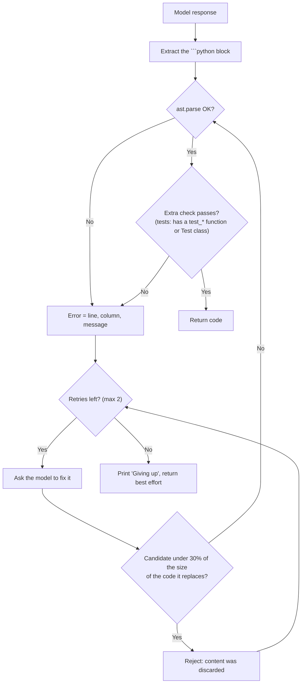

# Automated Self-Healing & Compiler Feedback Loops

This reference describes the self-healing code validation used by `local-coder` (implemented in `local_coder/healing.py` and shared by every skill).

---

## 1. Motivation

Local 7B code models (such as `qwen2.5-coder:7b`) are generally accurate, but quantization or an output cut off at the token limit can still produce:
- Truncated code blocks (missing closing parentheses or brackets).
- Misaligned indentation (`IndentationError`).
- Invalid syntax.

Instead of failing later at run time, the generated code is checked before it is returned, with a bounded feedback loop.

---

## 2. Validation



- **Syntax** is `ast.parse` only. There is no bytecode-compilation stage and the code is never executed.
- **Extra check**: generated tests must contain at least one `test_*` function or `Test*` class. Valid Python with zero tests is not a fix.
- **Shrink guard**: a candidate under 30% of the size of the code it replaces parses but usually means the model threw the content away, so it is rejected and counts as a failed attempt.

---

## 3. Feedback prompt

The repair request contains the code, the validation error and these instructions: fix the error, keep every function, class and test, and answer only with the corrected code in a ```python block. It is sent at `temperature: 0.0`.

---

## 4. What is and is not guaranteed

Output that was cut off at the token limit is not repaired at all (a repair request cannot restore the missing part): the loop prints `[Self-Healing] skipped` and the truncation warning applies. The tokens spent on repair rounds are added to the totals in the telemetry line.

After the last attempt the loop prints `[Self-Healing] Giving up (...)` on stderr and returns the best effort. **The returned code may still be invalid**; scripts that consume it should check the `[Self-Healing]` lines or validate it themselves. Output that stopped at `--max-tokens` is flagged separately with `⚠️ Output truncated`, and the repair request is limited by the same token budget.

---

## 5. Disabling Self-Healing

Self-healing is enabled by default for `code`, `test`, and `refactor`. (`--auto-heal` is accepted for compatibility and does nothing.) For anything that is not Python (shell, SQL, JSON, YAML, Go, Rust, ...) pass `--no-heal`:

```bash
python3 .agents/skills/local-coder/scripts/ask_local.py code \
  --task "Write an nginx configuration for reverse proxy" \
  --no-heal \
  --output nginx.conf
```
